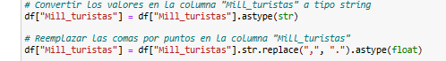

# proyecto-ETL-Turismo
PROYECTO ETL, BASE DE DATOS RELACIONAL SOBRE TURISMO EN ESPAÑA PARA CONSULTAR INFORMACIÓN DESDE 2015- 2020

• Planteamiento de las 5 consultas:

1ª. Porcentaje del motivo de viaje/turista en 2020. 2ª. Suma de turistas llegados a Madrid desde 2015 a 2020 por Meses. 3ª. ¿El trasporte más utilizado por los turistas en 2020? 4ª. ¿Cúal es la duración del viaje mayoritaria? 5ª. En el 2020, cúal ha sido el motivo del viaje mayoritario.

• Métodos utilizados en la extracción de la información: Beautiful soup Descargando csv

• Webs utilizadas por su fiabilidad en los datos:

https://www.ine.es/jaxiT3/Tabla.htm?t=12501
https://es.wikipedia.org/wiki/Turismo_en_España'
https://www.epdata.es/
Examinamos los datos que tenemos en Python y Excel

Hacemos limpieza básica en Python, Excel y SQL Limpieza básica: Quitamos columnas, sustituimos caracteres por otros, convertimos valores de columnas según nos interese, Limpiamos datos NaN, ponemos nuevos nombres a columnas…

Vemos la relación entre las tablas y creamos una tabla nueva ‘fechas’ con primary key ‘Fecha’ que nos va a ayudar a relacionar todas las tablas y hacer una base de datos relacional más consistente: