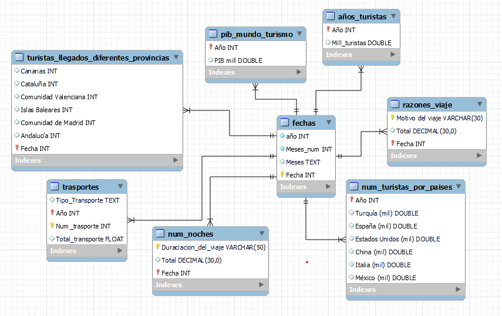
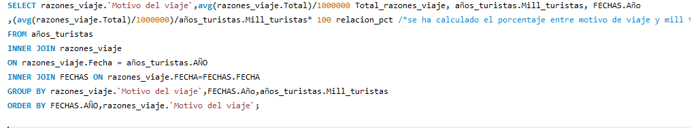
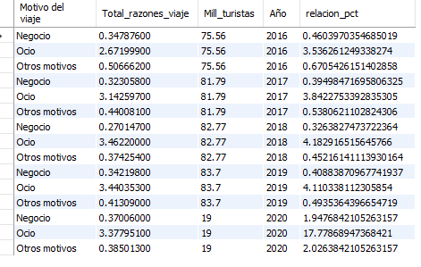
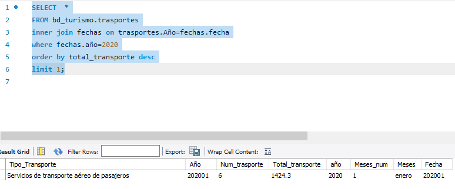
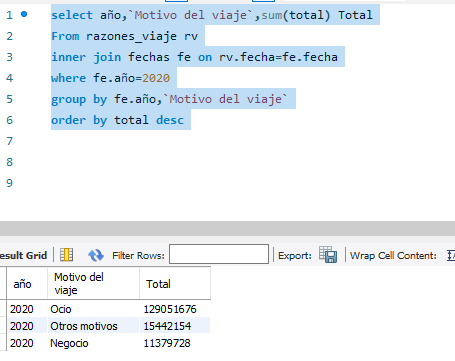

# proyecto-ETL-Turismo

PROYECTO ETL, BASE DE DATOS RELACIONAL SOBRE TURISMO EN ESPAÑA PARA CONSULTAR INFORMACIÓN DESDE 2015- 2020

• CINCO CONSULTAS A RESOLVER:

1ª. Porcentaje del motivo de viaje/turista en 2020. 

2ª. Suma de turistas llegados a Madrid desde 2015 a 2020 por Meses. 

3ª. ¿El trasporte más utilizado por los turistas en 2020? 

4ª. ¿Cúal es la duración del viaje mayoritaria? 

5ª. En el 2020, cúal ha sido el motivo del viaje mayoritario.

• METODOS utilizados en la extracción de la información: 

Beautiful soup 

Descargando csv

• WEBS utilizadas por su fiabilidad en los datos:

[ine](https://www.ine.es/jaxiT3/Tabla.htm?t=12501)

[wikipedia](https://es.wikipedia.org/wiki/Turismo_en_España')

[epdata](https://www.epdata.es/)

Examinamos los datos que tenemos en Python y Excel

Hacemos limpieza básica en Python, Excel y SQL 

Limpieza básica: Quitamos columnas, sustituimos caracteres por otros, convertimos valores de columnas según nos interese, Limpiamos datos NaN, ponemos nuevos nombres a columnas… hasta dejar csv limpios.

Vemos la relación entre las tablas y creamos una tabla nueva ‘fechas’ con primary key ‘Fecha’ que nos va a ayudar a relacionar todas las tablas y hacer una base de datos relacional más consistente:

rellenamos la nueva tabla, y hacemos la relación de nuestras tablas dejando una base relacional consistente.

PRIMERA QUERY:

Porcentaje del motivo de viaje/turista en 2020.

SEGUNDA QUERY:

Suma de turistas llegados a Madrid desde 2015 a 2020 por Meses; 
(en el siguiente proyecto haré un gráfico para ver la evolución).

TERCERA QUERY:
¿El trasporte más utilizado por los turistas en 2020? Según nuestra query es el transporte aéreo.

CUARTA QUERY: 

¿Cúal es la duración del viaje mayoritaria? 
Ninguna noche

QUINTA QUERY:
En el 2020 ¿cúal ha sido el motivo del viaje mayoritario?
Por Ocio

